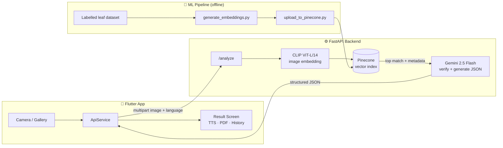

# 🌾 PestiCare — AI-Powered Crop Disease Diagnosis

<p align="center">
  
  
  
  
  
  
</p>

PestiCare is a cross-platform mobile app that helps farmers diagnose crop diseases from a single photo of a leaf. It combines **CLIP image embeddings**, **vector similarity search (Pinecone)**, and **Gemini** in a retrieval-augmented (RAG) pipeline to identify the disease and recommend a pesticide, its dosage, and where to buy a local equivalent in Pakistan — in **English or Urdu**.

> 📸 Snap a leaf → 🔍 AI identifies the disease → 💊 Get pesticide, dosage & 3-step treatment instructions → 🔊 Listen in Urdu or export as PDF.

---

## ✨ Features

- **Photo-based disease diagnosis** for wheat, cotton, and rice — camera or gallery.
- **RAG pipeline**: CLIP ViT-L/14 embeddings → Pinecone top-match retrieval → Gemini verifies the match against the actual image and generates structured advice, reducing hallucinated diagnoses.
- **Actionable output**: disease name, confidence score, active ingredient, application rate, 3-step instructions, plus a locally available pesticide equivalent and where to find it.
- **Confidence guarding**: predictions below 75% are rejected with a re-upload prompt; 75–85% shows a low-confidence warning.
- **Full Urdu localization** with RTL layout and the Noto Nastaliq Urdu font, switchable at runtime.
- **Text-to-speech** results (Urdu `ur-PK` and English) for low-literacy accessibility.
- **PDF reports** — generate, print, and share a diagnosis report.
- **Scan history** — last 50 scans persisted on-device with images.
- **Weather-aware disease risk** — live temperature/humidity from Open-Meteo (no API key) with a fungal-risk indicator.
- **Light & dark themes**, Material 3, animated transitions, Lottie analysis animation.

## 🏗️ Architecture



**How a diagnosis works:**

1. The app uploads the leaf photo (plus target language) to the FastAPI backend.
2. The backend embeds the image with **CLIP ViT-L/14** (768-dim, L2-normalized).
3. **Pinecone** returns the most similar disease record (cosine similarity) with its crop, disease, and treatment metadata.
4. **Gemini 2.5 Flash** receives both the *original image* and the retrieved metadata, verifies that the symptoms actually match, and returns a strict JSON response — translated into the user's language.
5. The app renders the result with confidence gating, TTS playback, PDF export, and history persistence.

## 📂 Repository Structure

```
pesticare/
├── lib/                  # Flutter app
│   ├── screens/          # Splash, language, home, upload, result, history, about
│   ├── providers/        # Language, prediction, theme state (Provider)
│   ├── services/         # API client, TTS, PDF reports, history, weather
│   ├── models/           # ScanRecord
│   ├── widgets/          # Crop cards, weather widget, theme toggle
│   └── data/             # Offline disease knowledge base (causes/symptoms/prevention)
├── backend/              # FastAPI inference server (CLIP + Pinecone + Gemini)
├── ml_pipeline/          # Offline embedding generation & Pinecone upload
├── assets/               # Images, Lottie animations, en/ur translations, Urdu font
└── android/ ios/ web/ …  # Flutter platform targets
```

## 🚀 Getting Started

### Prerequisites

- Flutter SDK ≥ 3.10 · Python ≥ 3.10
- A [Pinecone](https://www.pinecone.io/) API key and a [Gemini](https://ai.google.dev/) API key

### 1. Backend

```bash
cd backend
python -m venv venv && source venv/bin/activate   # Windows: venv\Scripts\activate
pip install -r requirements.txt
cp .env.example .env                               # then fill in your keys
uvicorn main:app --host 0.0.0.0 --port 8000
```

`.env`:

```env
PINECONE_API_KEY=your-pinecone-key
PINECONE_INDEX_NAME=pesticare-disease-embeddings
GEMINI_API_KEY=your-gemini-key
```

A GPU is used automatically if available; CPU works too. `backend/test_request.py` sends a smoke-test image to a running server.

### 2. ML pipeline (one-time index build)

Arrange your dataset as `dataset/<crop>/<disease>/<images>` inside `ml_pipeline/`, then:

```bash
cd ml_pipeline
pip install -r requirements.txt
python generate_embeddings.py            # or DATASET_DIR=/path/to/dataset python generate_embeddings.py
export PINECONE_API_KEY=your-pinecone-key
python upload_to_pinecone.py
```

### 3. Flutter app

```bash
flutter pub get
flutter run                              # Android emulator hits http://10.0.2.2:8000 by default
```

Point a physical device at your backend with a dart-define:

```bash
flutter run --dart-define=BACKEND_URL=http://192.168.1.20:8000
# or a tunnel, e.g. --dart-define=BACKEND_URL=https://your-tunnel.ngrok.app
```

## 📡 API Reference

### `POST /analyze`

| Field      | Type   | Description                          |
|------------|--------|--------------------------------------|
| `file`     | image  | Leaf photo (JPEG/PNG, multipart)     |
| `language` | string | `en` (default) or `ur`               |

**Response**

```json
{
  "crop": "Cotton",
  "disease": "Bacterial Blight",
  "confidence": 0.93,
  "pesticide": "Copper Oxychloride",
  "dosage": "2.5 g per litre of water",
  "instructions": "1. ... 2. ... 3. ...",
  "localPesticide": "Cobox (local equivalent)",
  "availabilityLocation": "Agricultural supply stores in Punjab"
}
```

## 🖼️ Screenshots

<!-- Add screenshots to docs/screenshots/ and link them here -->
| Home | Diagnosis | Urdu Mode |
|------|-----------|-----------|
| _coming soon_ | _coming soon_ | _coming soon_ |

## 🔒 Security Notes

- No API keys live in this repository — all credentials are read from environment variables (`backend/.env`, gitignored). Use `backend/.env.example` as a template.
- CORS is currently open (`*`) for development; restrict `allow_origins` before deploying publicly.
